# FitWear

> Premium mobile-first E‑commerce app built with React Native & Expo.

## Project Overview

FitWear is a premium E‑commerce mobile application built with React Native and Expo. It focuses on a seamless, mobile-first shopping experience for Men, Women, Kids, and Accessories, backed by Firebase for authentication and data storage.

## Key Features

- 🔐 **Authentication:** Secure sign-up and login using Firebase Authentication.
- 🛍️ **Product Discovery:** Categorized product browsing (Men, Women, Kids, Accessories) with a dedicated Shop page.
- ❤️ **Wishlist & Cart:** Real-time state management using React Context API for favorites and cart items.
- 🎟️ **Promotions:** Dynamic promo code system with real-time validation and formatted "amount needed" calculations to 2 decimal places.
- 🧭 **Modern UI:** Custom floating tab bar, mobile-optimized UI with Android edge-to-edge fixes and smooth iOS behavior.
- 🔁 **Backend:** Firebase Firestore for product/order data and Firebase Auth for user management.

## Tech Stack

- Frontend: React Native + Expo, TypeScript
- Routing: Expo Router (file-based routing)
- State Management: React Context API (Auth, Cart, Wishlist, Category)
- Backend: Firebase (Firestore, Authentication)
- Styling: React Native `StyleSheet` with a custom Cyan / Navy theme
- Icons & Media: Ionicons, Expo Font, HD images (Unsplash / Cloudinary)

## 📱 App UI Showcase

### 🔐 Authentication
<p align="center">
  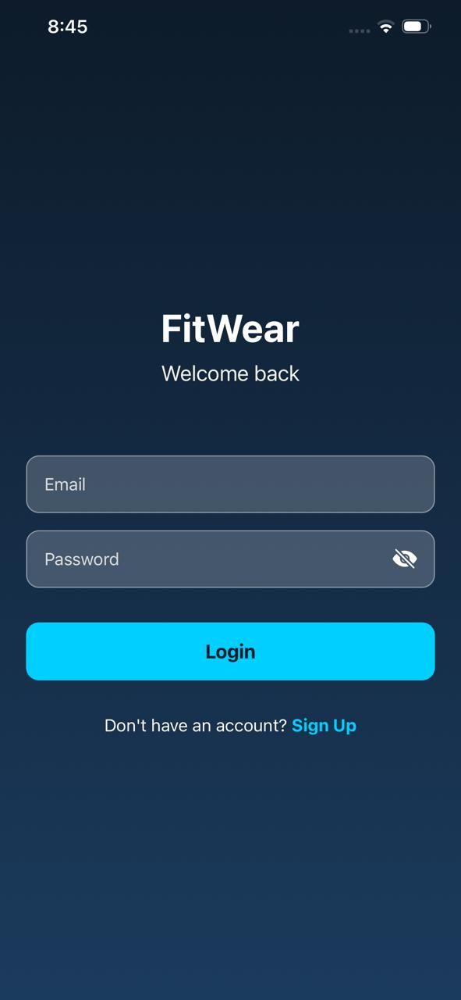
  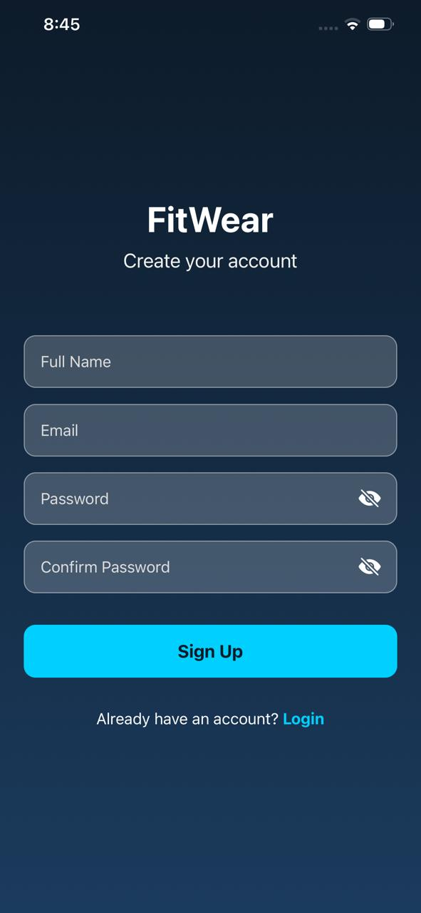
</p>

### 🏠 Core Experience
<p align="center">
  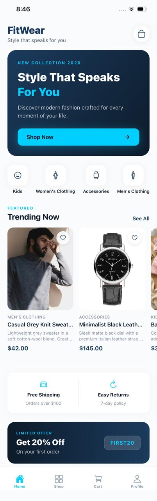
  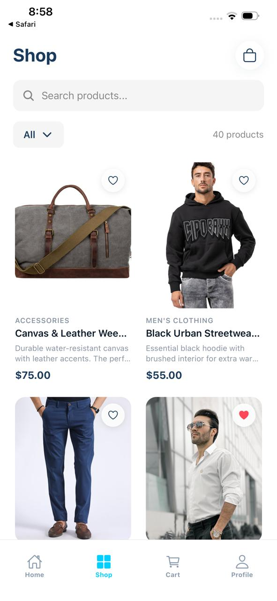
  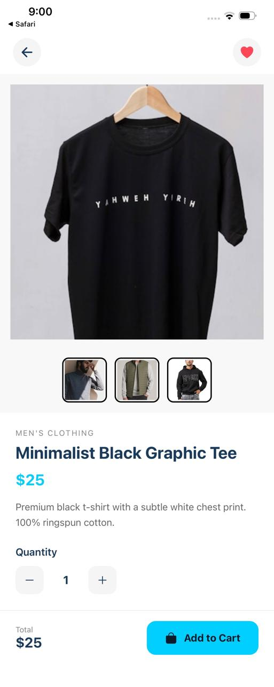
</p>

### 🛒 Shopping Flow
<p align="center">
  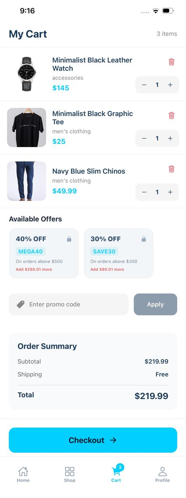
  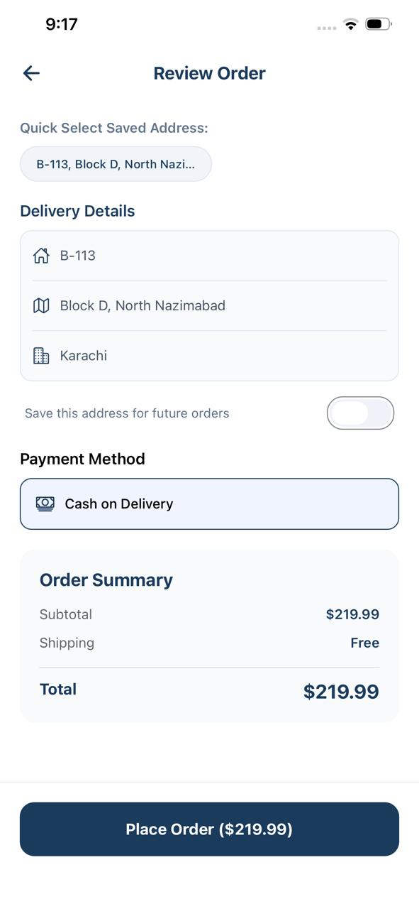
  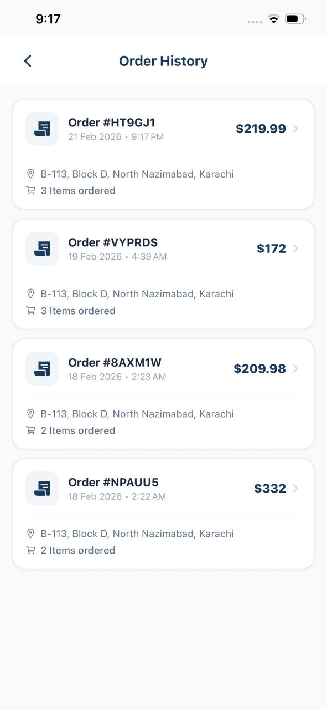
</p>

### 📦 Orders & Management
<p align="center">
  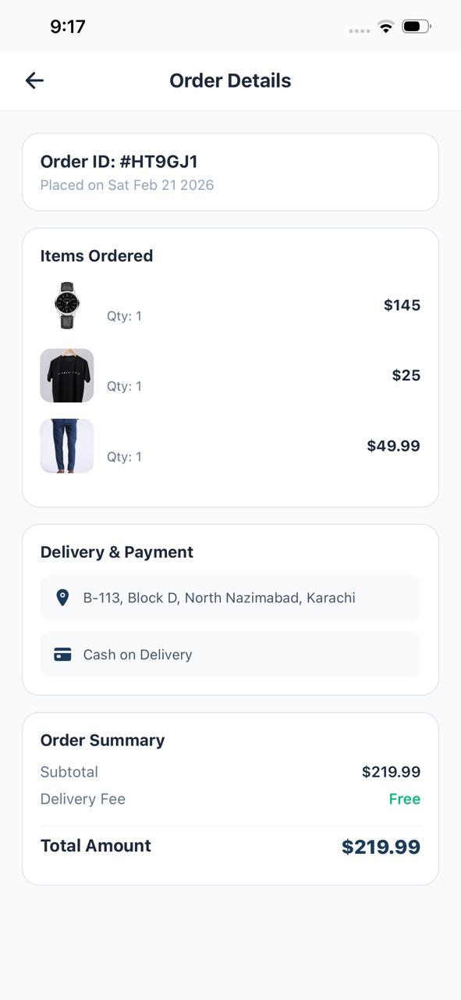
  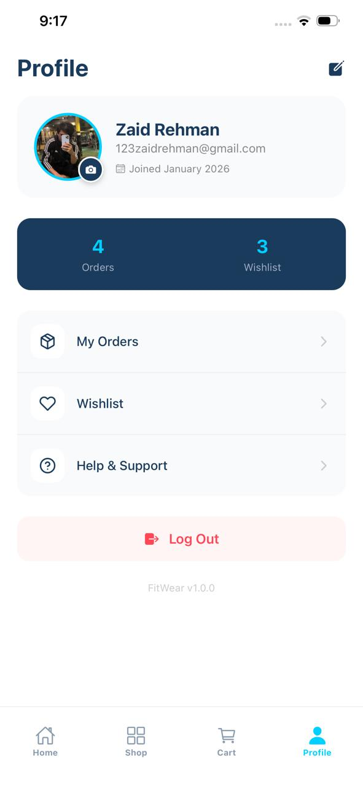
  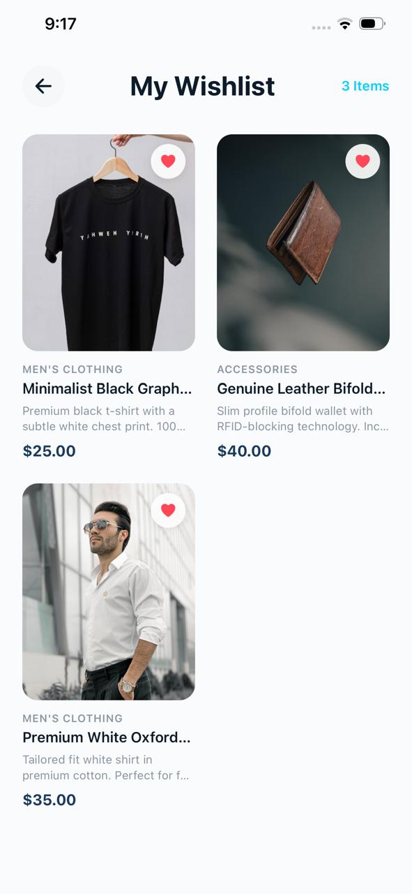
</p>

### 🛠️ Support
<p align="center">
  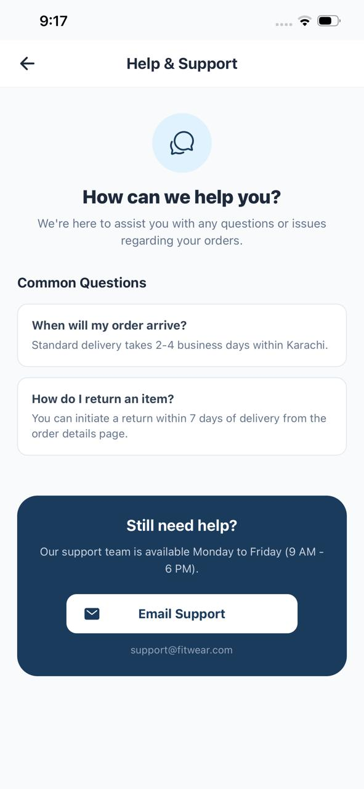
</p>

## Environment Setup

Create a top-level `.env` file to provide environment variables used by the app.

```env
EXPO_PUBLIC_FIREBASE_API_KEY
EXPO_PUBLIC_FIREBASE_AUTH_DOMAIN
EXPO_PUBLIC_FIREBASE_PROJECT_ID
EXPO_PUBLIC_FIREBASE_STORAGE_BUCKET
EXPO_PUBLIC_FIREBASE_MESSAGING_SENDER_ID
EXPO_PUBLIC_FIREBASE_APP_ID

EXPO_PUBLIC_CLOUDINARY_CLOUD_NAME
EXPO_PUBLIC_CLOUDINARY_UPLOAD_PRESET
```

## Project Structure (high level)

Brief overview of the important folders and files:

- `/app` — Expo Router entry points and screen routes (file-based routing). Contains route layouts for `(auth)`, `(tabs)`, and feature screens.
- `/components` — Reusable UI components (product cards, headers, checkout components, etc.).
- `/context` — React Context providers: `AuthContext`, `CartContext`, `CategoryContext`, `WishlistContext`.
- `/hooks` — Custom hooks (products, categories, checkout, image picker, user, wishlist).
- `/services` — API-like adapters for Firebase: `authService`, `productService`, `orderService`, `wishlistService`, etc.
- `/config` — App configuration including `config/firebase.ts` (Firebase keys & initialization).
- `/assets` — Images, fonts and other static media.
- `/utils` — Helpers, theme values, toast utilities and seed data.

This structure is mobile-first and optimized for fast iteration on screens and shared components.

## How to Run (Development)

1. Install dependencies:

```bash
npm install
```

2. Start the Expo development server:

```bash
npx expo start
```

3. Run on Android/iOS simulators or devices:

```bash
npm run android   # Expo-managed Android run
npm run ios       # Expo-managed iOS run (macOS only)
```

Notes:
- The project uses `expo-router` — open the QR code in the Expo Go app or use a dev client for native modules.
- For Android edge-to-edge behavior and reanimated/gesture handlers, prefer a dev client (`expo-dev-client`) when testing native integrations.

## Firebase Setup

1. Create a Firebase project and enable **Authentication (Email/Password)** and **Cloud Firestore**.
2. Add your Firebase config to `/config/firebase.ts` and ensure the file exports the initialized Firebase app used by services.
3. Secure Firestore rules appropriately for production.
